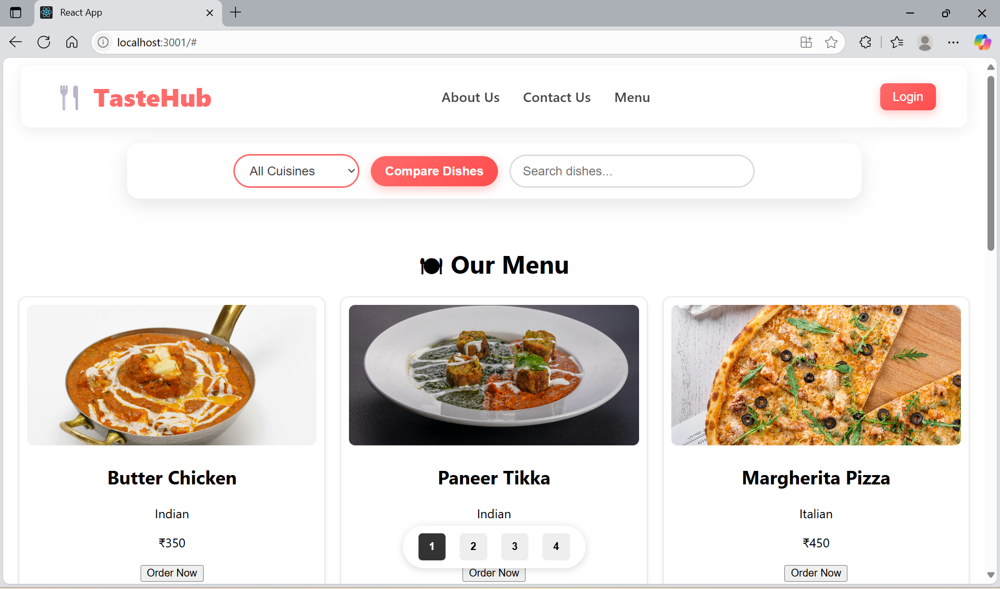
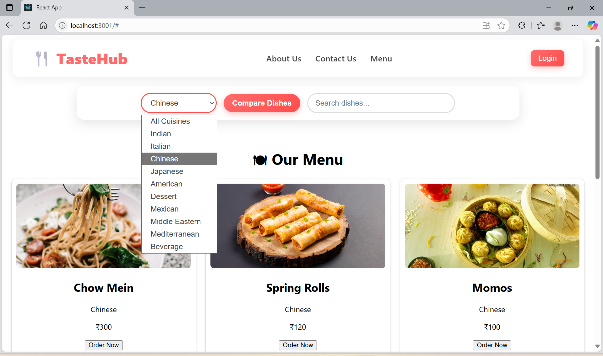
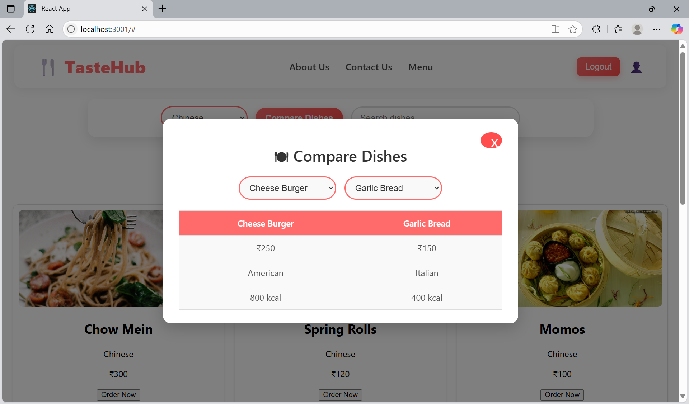
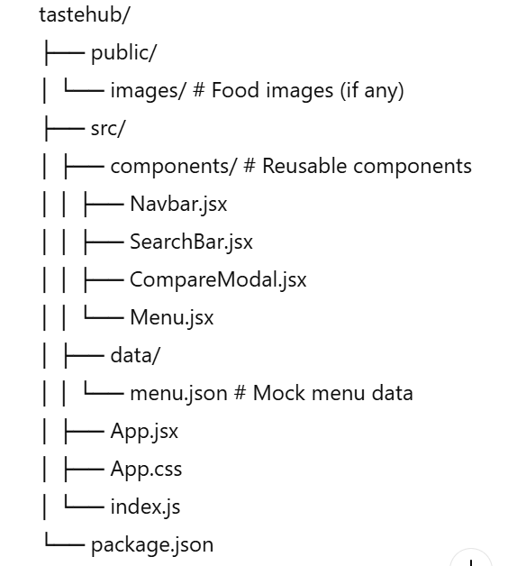

HEAD
# Getting Started with Create React App

This project was bootstrapped with [Create React App](https://github.com/facebook/create-react-app).

## Available Scripts

In the project directory, you can run:

### `npm start`

Runs the app in the development mode.\
Open [http://localhost:3000](http://localhost:3000) to view it in your browser.

The page will reload when you make changes.\
You may also see any lint errors in the console.

### `npm test`

Launches the test runner in the interactive watch mode.\
See the section about [running tests](https://facebook.github.io/create-react-app/docs/running-tests) for more information.

### `npm run build`

Builds the app for production to the `build` folder.\
It correctly bundles React in production mode and optimizes the build for the best performance.

The build is minified and the filenames include the hashes.\
Your app is ready to be deployed!

See the section about [deployment](https://facebook.github.io/create-react-app/docs/deployment) for more information.

# 🍴 TasteHub – Restaurant Menu App

TasteHub is a modern  restaurant web app built with **ReactJS**. It allows users to browse dishes, search and filter by cuisine, compare two dishes side-by-side, and calculate the total bill with GST & tips.  

---

## 🚀 Features

✅ **🍽 Restaurant Menu** – Browse delicious dishes with images, price, calories, and cuisine type.  
✅ **🔎 Search & Filter** – Search dishes by name and filter by cuisine dynamically.  
✅ **📊 Compare Dishes** – Compare two selected dishes side-by-side for price, calories, and cuisine.  
✅ **🔐 Login/Logout** – Simple authentication system for user sessions.  
✅ **💸 Bill Calculator (Optional)** – Calculate total price with GST & tips.  
✅ **📄 Pagination** – Navigate through large menus smoothly (15 dishes per page).  
✅ **🌟 Modern UI/UX** – Clean and elegant design with responsive layouts.  

---

## 🖥️ Screenshots

### 🌟 Home Page (Navbar + Search)

### 🔎 Filter & Search

### 🍽 Compare Dishes Modal

---

## 🛠️ Tech Stack

- ⚛️ **ReactJS** (Frontend library)  
- 🎨 **CSS3** (Modern styling with responsive design)  
- 📦 **JSON** (Mock data for menu and users)  
- ❤️ **Pexels API** (Free images for food items)  

---

## 📂 Folder Structure
/i

